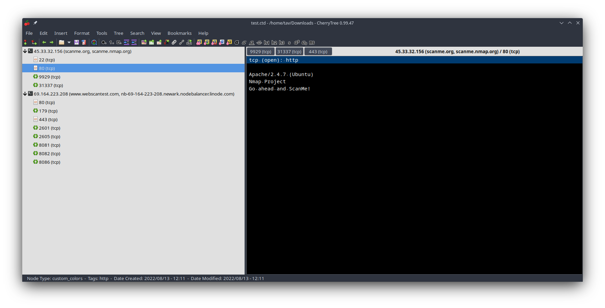

# Overview
This is a random collection of different recon tools I wrote. They are all not "large enough" to deserve an own repo but I find them quite handy.

To use the python tools, I recommend using virtual environments to install the dependencies:

```bash
python3 -m venv .
source bin/activate
pip install -r requirements.txt
```
## [nmap2cherrytree.py](nmap2cherrytree.py)
Convert XMLs from `nmap` scans into [cherrytree](https://www.giuspen.com/cherrytree/) files.

```
nmap -sV -sC -oX scan.xml scanme.org www.webscantest.com
python3 nmap2cherrytree.py scan.xml > scan.ctd
```
Then open `scan.ctd` in cherrytree


## [redirects.sh](redirects.sh)
Use [`gau`](https://github.com/lc/gau) and [`httpx`](https://github.com/projectdiscovery/httpx) to find URLs that could possibly be used as open redirects.

```bash
Usage: ./redirects.sh [-s|--subs] [-h|--help] [-k|--keep-temp] [-v|--verbose] DOMAIN OUTFILE
```

## [robots.py](robots.py)
Probe URLs listed in `robots.txt`.

```bash
$ printf "https://shop.tesla.com/\nhttps://www.tesla.com" | python3 robots.py
{
    "https://shop.tesla.com/": [
        {
            "tag": "Disallow",
            "url": "https://shop.tesla.com//*.json",
            "status_code": "-1"
        }
    ],
    "https://www.tesla.com": [
        {
            "tag": "Allow",
            "url": "https://www.tesla.com/themes/*.jpg",
            "status_code": "-1"
        },
        {
            "tag": "Allow",
            "url": "https://www.tesla.com/profiles/*.js$",
            "status_code": "-1"
        },

        ...

        {
            "tag": "Disallow",
            "url": "https://www.tesla.com/node/",
            "status_code": "403"
        },
        {
            "tag": "Allow",
            "url": "https://www.tesla.com/content/dam/tesla-site/",
            "status_code": "403"
        }
    ]
}

```

## [schall_und_rauch.py](schall_und_rauch.py)
The script can be used to find domain names using various techniques:
- reverse ip lookup
- SNI extraction
- recursive CNAME resolution

it also can unfold cidr ranges, which is handy when using the tool. Some examples:
```bash
$ echo -n 140.82.121.0/24 | python3 names.py cidr | python3 names.py sni
{
    "140.82.121.10": [
        "*.github.com"
    ],
    "140.82.121.12": [
        "*.github.com"
    ],
    "140.82.121.14": [
        "*.githubusercontent.com"
    ],
    "140.82.121.3": [
        "github.com"
    ],
    "140.82.121.9": [
        "*.github.com"
    ],

    ...

}
$ echo -n 140.82.121.0/24 | python3 names.py cidr | python3 names.py reverse
{
    "140.82.121.34": [
        "lb-140-82-121-34-fra.github.com."
    ],
    "140.82.121.36": [
        "lb-140-82-121-36-fra.github.com."
    ],
    "140.82.121.3": [
        "lb-140-82-121-3-fra.github.com."
    ],
    "140.82.121.11": [
        "lb-140-82-121-11-fra.github.com."
    ],
    "140.82.121.14": [
        "lb-140-82-121-14-fra.github.com."
    ],
    "140.82.121.12": [
        "lb-140-82-121-12-fra.github.com."
    ],
    "140.82.121.1": [
        "lb-140-82-121-1-fra.github.com."
    ],
    "140.82.121.19": [
        "lb-140-82-121-19-fra.github.com."
    ],
    "140.82.121.35": [
        "lb-140-82-121-35-fra.github.com."
    ],

    ...
    
}
$ subfinder -silent -d tesla.com | python3 names.py cnames | head -n 100
{
    "url4104.tesla.com": [
        "sendgrid.net."
    ],
    "origin-finplat-stg.tesla.com": [
        "clsfins.tesla.com.akadns.net."
    ],
    "wdm.kronos.tesla.com": [
        "kronos-wdm-nlb-0558dc9e908f5182.elb.us-west-2.amazonaws.com."
    ],
    "akamai-apigateway-teslaservice-api.tesla.com": [
        "akamai-apigateway-teslaservice-api.tesla.com.edgekey.net.",
        "e1792.dscx.akamaiedge.net."
    ],
    "url5347.tesla.com": [
        "sendgrid.net."
    ],
    "zta-setup.tesla.com": [
        "eaa-teslazero-cn-rdp.teslamotors.com.srip.net.",
        "srip1555.globalredir.akadns.net.",
        "a1555.srip1.akasrip.net.73c1340d.1.cn.akasripcn.net."
    ],
    "solarbonds.tesla.com": [
        "solarbonds.tesla.com.edgekey.net.",
        "e1792.dscx.akamaiedge.net."
    ],
    "origin-edr.tesla.com": [
        "clsgenp.tesla.com.akadns.net."
    ],
    "akamai-apigateway-prd-global-deliveryopsapi.tesla.com": [
        "akamai-apigateway-deliveryopsapi.tesla.com.edgekey.net.",
        "e1792.dscx.akamaiedge.net."
    ],
    "akamai-apigateway-vendorpartsapi.tesla.com": [
        "akamai-apigateway-vendorpartsapi.tesla.com.edgekey.net.",
        "e1792.dscx.akamaiedge.net."
    ],
 
    ...

```